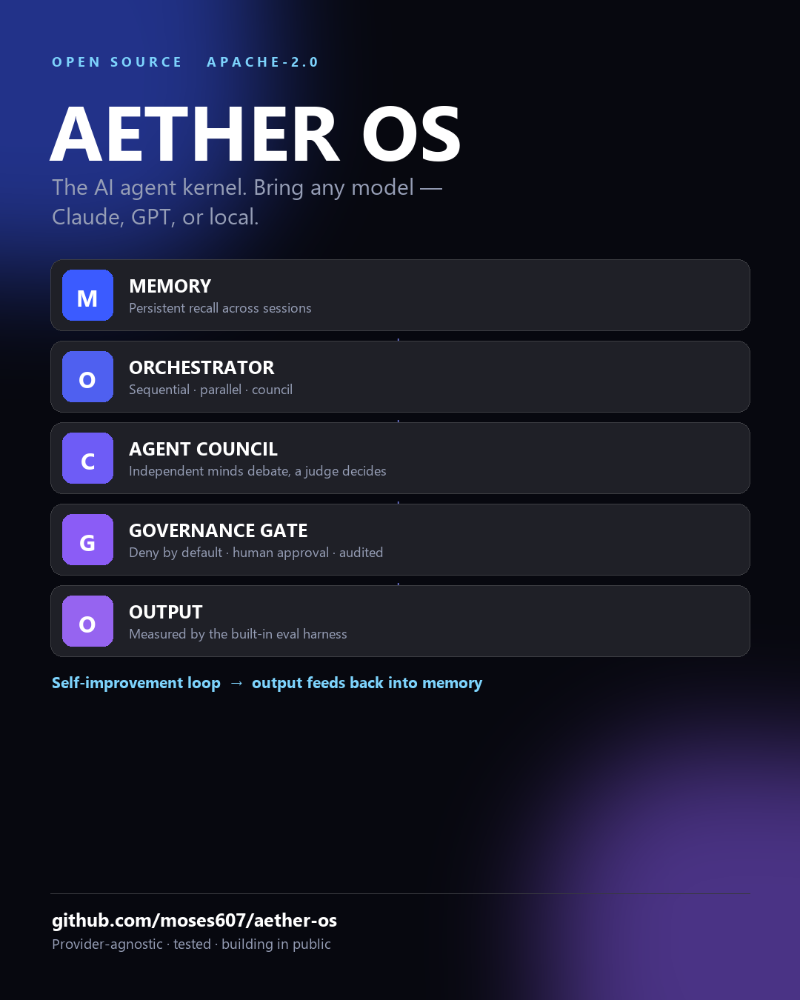

# ⚡ Aether OS



**An open-source, model-agnostic AI agent kernel — memory, a governed orchestrator, and an evolved skills system — that any capable model (Claude, GPT-class, local) plugs into.**

Most agent frameworks are either SDK-heavy, locked to one provider, or a pile of skills with no kernel underneath. Aether OS is the opposite bet: **a small, provider-agnostic kernel** — persistent memory + a governed multi-agent orchestrator + an auto-discovered skills system — that you point at *any* model and *any* interface.

> **Status: v0.2 — building in public.** The kernel below is **real, runnable, and tested**: memory, skills registry, orchestrator (sequential + council), governance, **eval harness**, **cost tracking**, the `Session` API, and the CLI. Vector/graph memory, MCP/VS-Code/web adapters, the self-improving Researcher, sandboxing, and crypto skill-verification are on the [roadmap](ROADMAP.md) and clearly marked as such. No vaporware claims — what's built is built; what's planned says "planned."

[](https://github.com/moses607/aether-os/actions) · Apache-2.0 · Python ≥ 3.10 · zero-dependency base tier

---

## 🚀 Quickstart (works right now)

```bash
git clone https://github.com/moses607/aether-os && cd aether-os
pip install -e .

# persistent memory (SQLite + full-text recall)
python -m aether.cli remember "Ship Aether OS v0.1 on Friday" --kind decision
python -m aether.cli recall launch
python -m aether.cli memories

# auto-discover skills
python -m aether.cli skills --path skills
```

One object wires it all together (agents are just callables — **bring your own model**):

```python
from aether.session import Session
from aether.kernel.governance import Action, AllowlistPolicy

s = Session(db="aether.db", skills_path="skills",
            policy=AllowlistPolicy({"tool": ["memory."]}), approver=ask_human)

s.remember("User prefers concise answers", kind="fact")

# The kernel's core value: assemble ONLY the context this task needs
ctx = s.context_for("write me a hook for a video")
# -> {"task": ..., "memories": [...], "skills": [{"name": "hooks", "body": ...}]}

# Reliability: independent agents + a judge beat one guess
result = s.run_council([agent_a, agent_b, agent_c], task, judge=judge_agent)

# Safety: nothing side-effecting runs without policy + (if risky) a human. All audited.
if s.authorize(Action("tool", "memory.write", risk="high")):
    ...
```

Measure changes instead of guessing, and see what a run costs:

```python
from aether.kernel.evals import Case, EvalHarness, contains
from aether.kernel.tracking import Price, UsageTracker

report = EvalHarness(scorer=contains).run(my_agent, [Case("2+2?", expect="4")])
print(report.summary())        # cases=1 pass_rate=100% mean_score=1.00 failures=0

usage = UsageTracker({"my-model": Price(input_per_mtok=3.0, output_per_mtok=15.0)})
usage.record("researcher", "my-model", prompt_tokens=1200, completion_tokens=300)
print(usage.report())          # prices are yours to supply — stale tables lie about spend
```

---

## 🧠 Architecture (one glance)

```
      ┌───────────── Adapters (terminal ✓ · MCP · VS Code · Web) ─────────────┐
      │                                                                       │
      ▼                                                                       │
  ┌──────────────────────────── KERNEL ────────────────────────────┐         │
  │  Skills (SKILL.md registry) → Orchestrator (sequential/council) │         │
  │                    │                        │                   │         │
  │                    ▼                        ▼                   │         │
  │            Governance gate  ── deny-by-default + human approval │         │
  │                    │                                            │         │
  └────────────────────┼────────────────────────────────────────────┘        │
                       ▼                                                       │
        Memory hierarchy:  L1 SQLite+FTS ✓  ·  L2 vector (planned) · L3 graph (planned)
                       │                                                       │
                       └──────── self-improvement loop (Researcher, planned) ──┘
```

Full write-up in [`ARCHITECTURE.md`](ARCHITECTURE.md) · decisions in [`DECISIONS.md`](DECISIONS.md) · the reliability model is council/debate + a verifier + the governance gate.

## 🧩 Skills

A skill is a directory with a `SKILL.md` (frontmatter + markdown playbook). The registry auto-discovers them; the model routes on the `description`. Ships with:

- **`skill-forge`** — a meta-skill that *generates new skills* on demand.
- **`researcher`** — a self-improvement scout (pair it with a browsing/search tool; it has no live web knowledge on its own).
- **`evaluator`** — an auto-eval + hallucination guard: scores output, flags unsupported claims, returns accept/revise/reject.

Format spec: [`docs/skill-format.md`](docs/skill-format.md).

## 🔒 Security by default

Autonomous agents are dangerous by default. Aether treats **all tool/model output as untrusted data, never commands**, and routes every side effect through a **deny-by-default policy** with a **human-approval gate** for high-risk actions and an **append-only audit log**. Sandboxing, signed skills, and dependency scanning are on the roadmap. See [`SECURITY.md`](SECURITY.md).

## 🆚 Why another framework?

The design goal is **2× on reliability, extensibility, and safety** vs. skill-collections and provider-locked SDKs — through a tiny governed kernel rather than a heavy framework. These are **design goals, not benchmarked claims** (yet — an eval harness is on the roadmap). Studied for architecture, not code: Superpowers, VoltAgent/awesome-agent-skills, AIOS, Microsoft Agent Framework.

## 🗺️ Roadmap & 🤝 Contributing

[`ROADMAP.md`](ROADMAP.md) (Now / Next / Later) · [`CONTRIBUTING.md`](CONTRIBUTING.md). The base kernel is stdlib-only by design — keep it that way; optional deps go behind extras. New features need tests.

## ⭐ Star it / build on it

If the architecture is useful, a star helps others find it. Issues and PRs welcome — this is meant to be **forked and built upon**.

## 📄 License

[Apache-2.0](LICENSE) © 2026 Cherry FRANCOIS. *Built by the maker of [SkillForge](https://github.com/moses607/skillforge) & [SocialForge](https://github.com/moses607/socialforge).*
